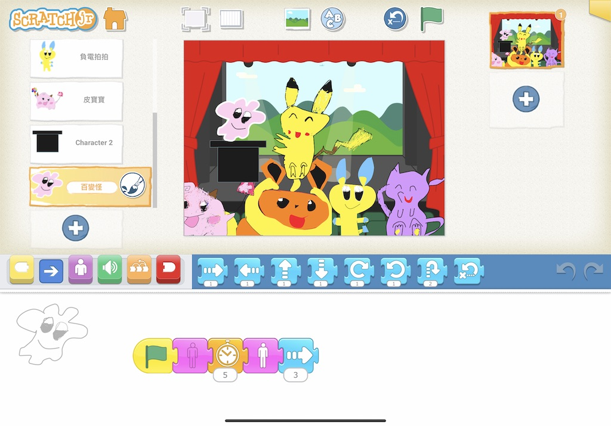

### Hi,我是Jess媽

我的本業是軟體程式設計師，工作內容為開發金融前後端系統，做這行的好處（也是壞處）就是永遠有學不完的新技術，當身邊充滿了許多有趣的新興科技，不知不覺就會被影響，由程式設計相關領域開始產生好奇，想要更深的了解專研的時候，就形成了一個自學的過程。

當了媽媽以後，對程式喜歡自學的我，也開始關注起兒童程式這塊領域，從Scratch. ScratchJr. Raspberry Pi. Micro:bit ...為了了解現行的兒童程式教育，還曾兼職當過一年多的Scratch老師（學生為小三到小六），一開始從助教當起，觀察其他老師上課方式，發現若用傳統的老師說學生聽的教學方式，孩子容易只為了達成上課完成進度，快快將Scratch積木都照老師的範例抄寫，不太思考或是理解為什麼要這樣寫程式。

所以在我開始轉當Scratch老師之後，教學方式做了一些調整，參考了張輝誠老師的學思達教學法，王政忠老師的MAPS教學法，實際應用在Scratch的教學中，將班上的孩子分為兩組，在上課的過程中，用搶答的方式讓他們觀察及思考，並帶入日常生活孩子可以理解的日常現象當做程式邏輯的說明，例如用自動販賣機說明程式邏輯判斷流程，用不同的箱子說明變數與序列的概念，從孩子課堂上對我教學的喜愛及支持，這一年多的兼課讓我對兒童程式教育充滿信心。

### 製作Blog/Youtube頻道的初心

今年，我六歲的兒子指著電腦上的Scratch說：『媽媽，我也想要玩電腦。』

為了試探他是否真的有興趣，我隨手在5分鐘內，網路上抓了一張他最愛的Pokémon遊戲的角色「皮卡丘」的去背圖，上傳到Scratch,並請他用Scratch錄了一段『皮咖秋』的錄音，設定重複播放20次，並讓皮卡丘轉了一個圈，播完以後他眼睛都亮了，好像是我變了個魔術一樣，我問他想不想學？他直呼他想學，我才驚覺小小孩也是會想學程式的。

坊間對於幼兒學程式的概念尚不普及，我猜測也許他們只是缺少一個學習及接觸的機會，所以我趁著今年暑假，也就是疫情最嚴重的期間，幼兒園或小學紛紛停課，改用線上課程教學，我也舉辦了ScratchJr線上學習課程，邀請兒子及幼兒園同學們（5~8歲幼兒）及有興趣的家長，一起在週六的下午來場線上課程。

這兩個月，我使用了Code.org 及 ScratchJr教學，看著線上的同學們，小小孩使用ScratchJr與我分享他用喜愛的角色創作了他人生中的第一套遊戲，又或是跟我報告他又過了Code.org的第幾關，那樣的自信，並期待下一堂課，共學的父母們也因此感受到孩子學程式可以創作的實用性及魅力。
  

這些回饋變成我持續教學及分享的最大動力。

希望這個Blog/Youtube頻道能與更多家長及孩子分享程式教育的資源及心得。

準備好了嗎？一起開始學習程式之旅吧。

