### 寫程式不是很難嗎？ 5歲兒童開始寫程式？

你沒聽錯，今年暑假，我教過15位介於5到8歲的孩子們，使用 ScratchJr 寫程式製作出人生中的第一款自製遊戲。

身為家長的你，很好奇什麼是 ScratchJr 嗎？

我彙整了開始學習ScratchJr前，你一定會想先了解的5大問題，讓我們一起看下去。

#### 問題1： ScratchJr是什麼？適合甚麼年齡的孩子呢？

ScratchJr是一個免費APP,是由美國MIT(麻省理工學院)開發及維護的一套軟體，提供給5-8歲第一次嘗試程式設計的孩子們，用拖拉（dragging and dropping）的方式將一個一個像是樂高積木的程式，有順序的組合起來後，就可以撰寫程式，讓畫面上的角色動起來。

> 你對寫程式的印象，還停留在用鍵盤一個一個打出英文字的黑底白字的介面嗎？對兒童來說，這樣的介面不僅學習困難，而且會大大減少他們的學習意願，所以教孩子使用積木拖拉方式寫程式（Drag-and-drop programming）已經是一種趨勢。撰寫程式的難度降低後，即使是5歲的兒童也可以從ScratchJr開始學習程式設計。

孩子可以在這個APP藉由拉積木的方式，說故事，做動畫，設計卡片，做互動遊戲，讓他們發揮創意之外，也可以學習程式的基礎概念。

  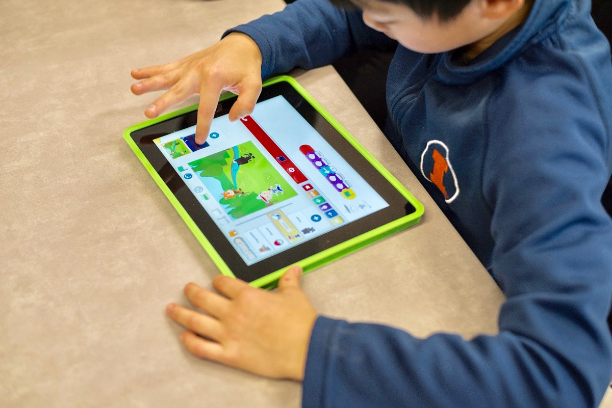

#### 問題2： ScratchJr可安裝在哪裡呢？

可安裝於以下的硬體上：

- iPad (需要 iPadOS 9.3 或以上版本)，但無法安裝於iPhone：[到 App Store 安裝](https://apps.apple.com/us/app/scratchjr/id895485086?ls=1)

- Android手機或Android Pad上：[到 Google Play 安裝](https://play.google.com/store/apps/details?id=org.scratchjr.android)

- 若要安裝於桌上電腦或是筆記型電腦:
  
  * 若你是Chromebook OS的筆電：[到 Chrome web store 安裝](https://chrome.google.com/webstore/detail/scratchjr/oipimoeophamdcmjcfameoojlbhbgjda)
    
  * 若你不是Chromebook OS的電腦：需安裝Bluestacks後（Android模擬器），再安裝ScratchJr
    
    1. 請連至 [Bluestacks 台灣官網](https://www.bluestacks.com/tw/index.html)
      * Bluestacks：是一種 Android 模擬器，安裝在你的電腦或是筆電後，電腦就變成一台Android手機，可以在電腦上下載並使用APP。

    2. 安裝Bluestacks到電腦上：
      * [Windows安裝參考這裡](https://support.bluestacks.com/hc/zh-tw/articles/360013662851-%E5%A6%82%E4%BD%95%E4%B8%8B%E8%BC%89%E5%92%8C%E5%AE%89%E8%A3%9DBlueStacks-)
           
      * [Mac安裝參考這裡](https://support.bluestacks.com/hc/zh-tw/articles/360000736632-%E5%A6%82%E4%BD%95%E5%9C%A8Mac%E7%B3%BB%E7%B5%B1%E4%B8%8A%E5%AE%89%E8%A3%9D%E4%B8%A6%E5%95%9F%E5%8B%95BlueStacks-)
  
  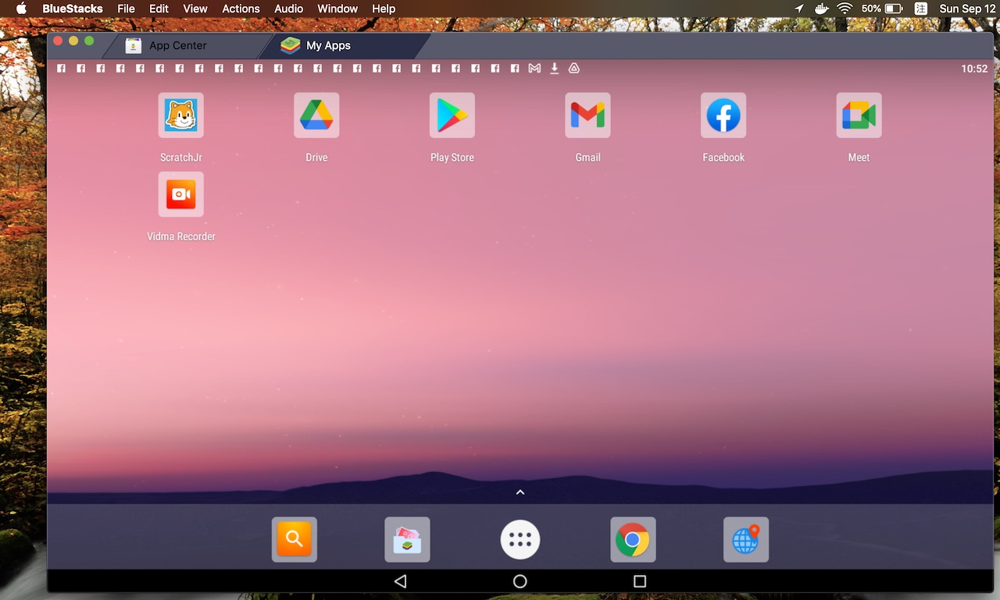
  
#### 問題3： ScratchJr的主要功能是什麼呢？一開始可以怎麼帶孩子玩呢？

安裝完成後，請孩子打開ScratchJr

* 安裝後第一次開啟會出現「允許使用攝影機功能」或是「允許使用麥可風功能」，請按「允許」（Allow）
  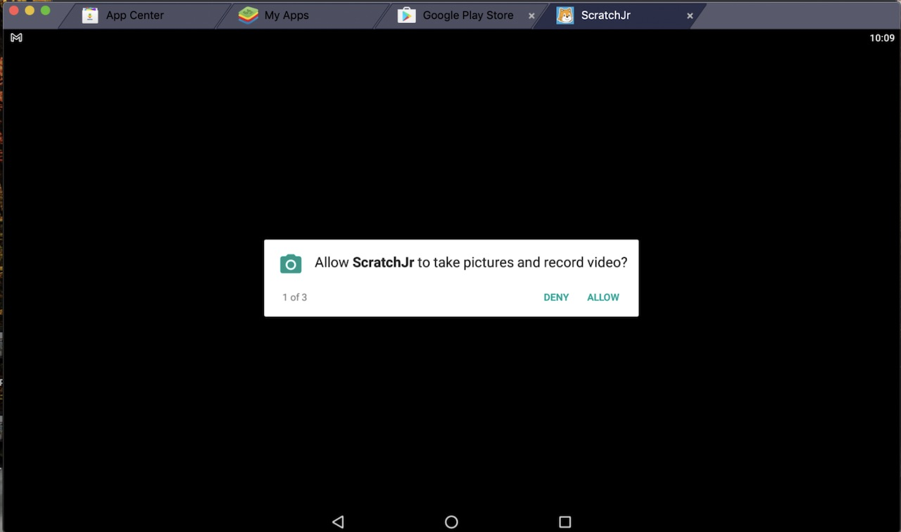

* 第一次開啟才會出現，詢問預計在哪裡使用，請選擇任一選項：

  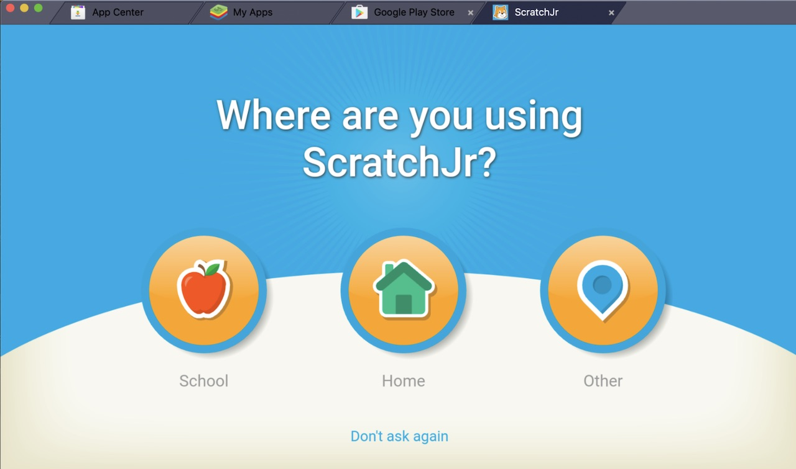

* 進入ScratchJr主畫面，點擊左側的小房子圖案：
  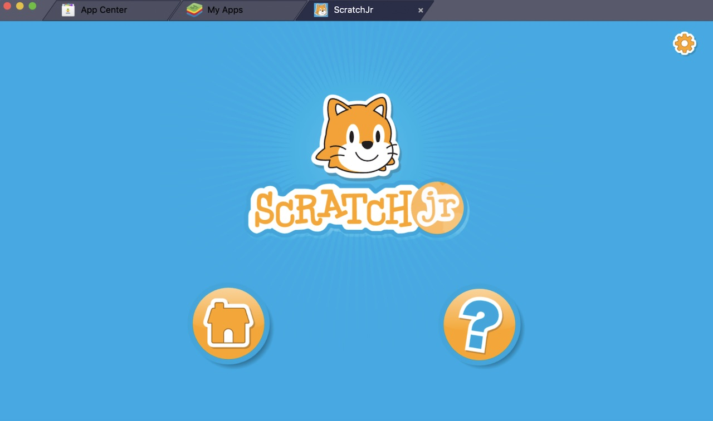

* 進入 My Projects 這裡是你創造自己的故事/遊戲/動畫...的地方，請按＋開始一個新專案：
  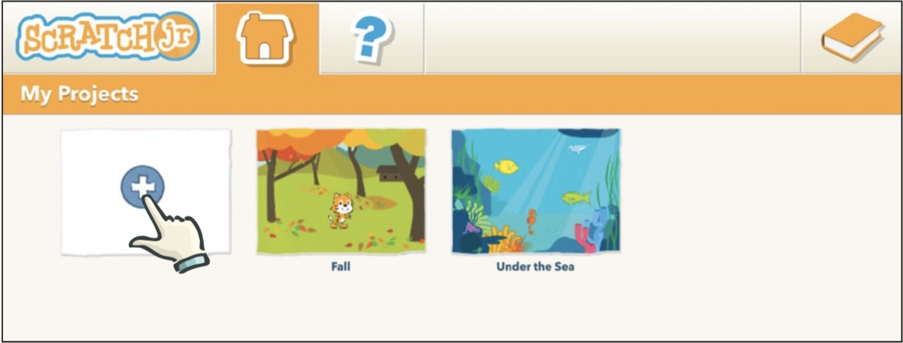

* 一開始讓孩子剛開始嘗試時，建議可以先讓他們自由探索，看到的東西都點點看：
  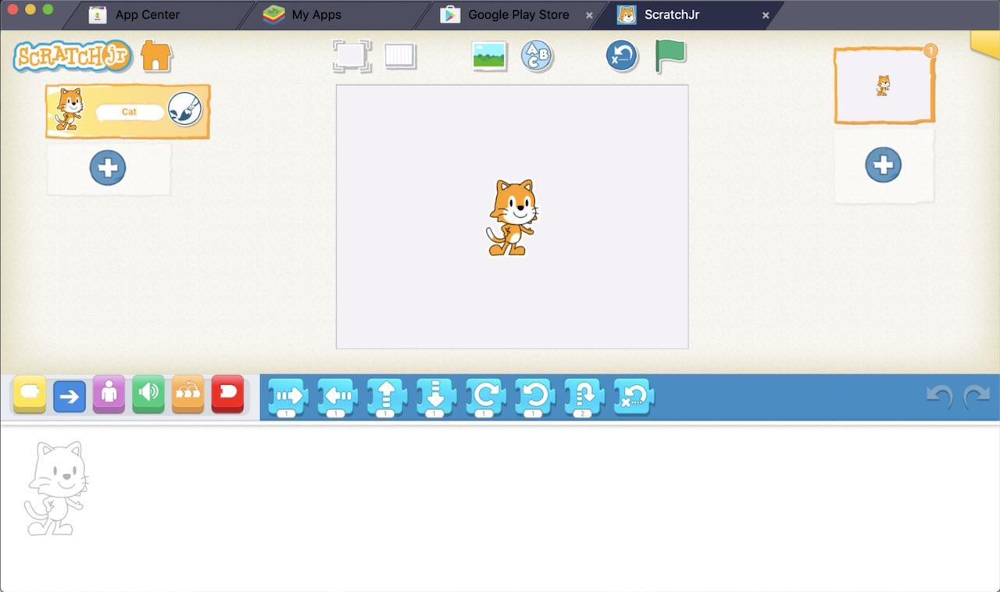

* 可以跟孩子介紹一下使用介面：
  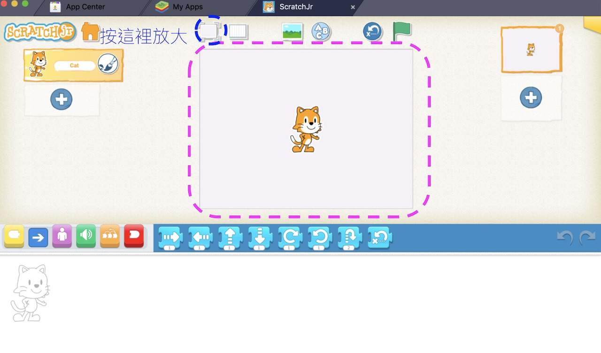
  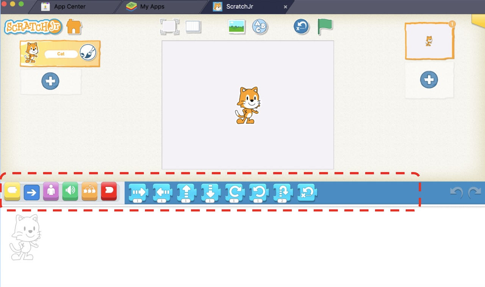  
  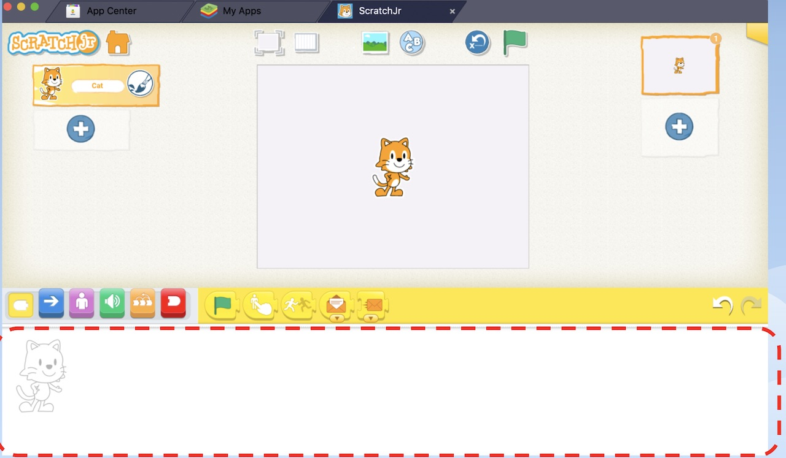   

* 可以試試替換背景，或是用軟體中類似小畫家的功能，畫出自己想要的背景：
  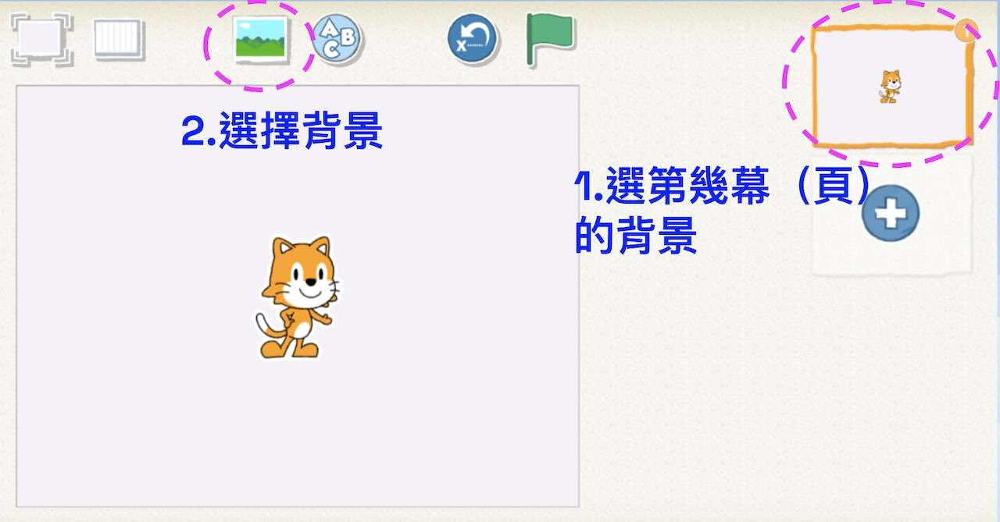
  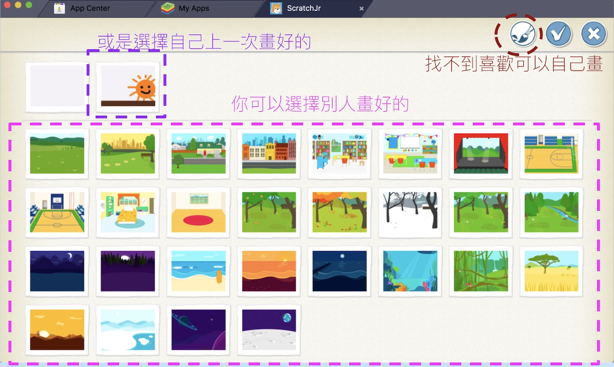

* 可以試試選擇一個自己的角色，或是用軟體中類似小畫家的功能，畫出自己想要的角色：
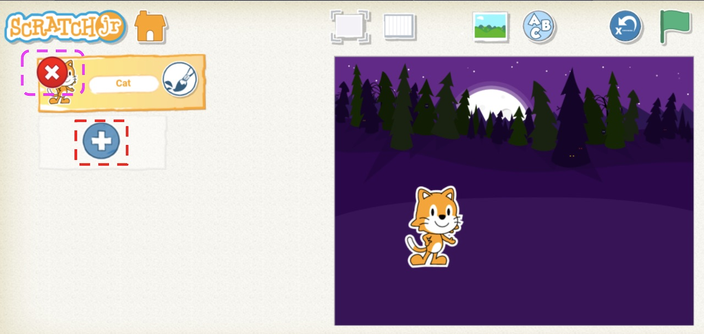

* 點擊 ？號，與孩子一起探索更多功能：
 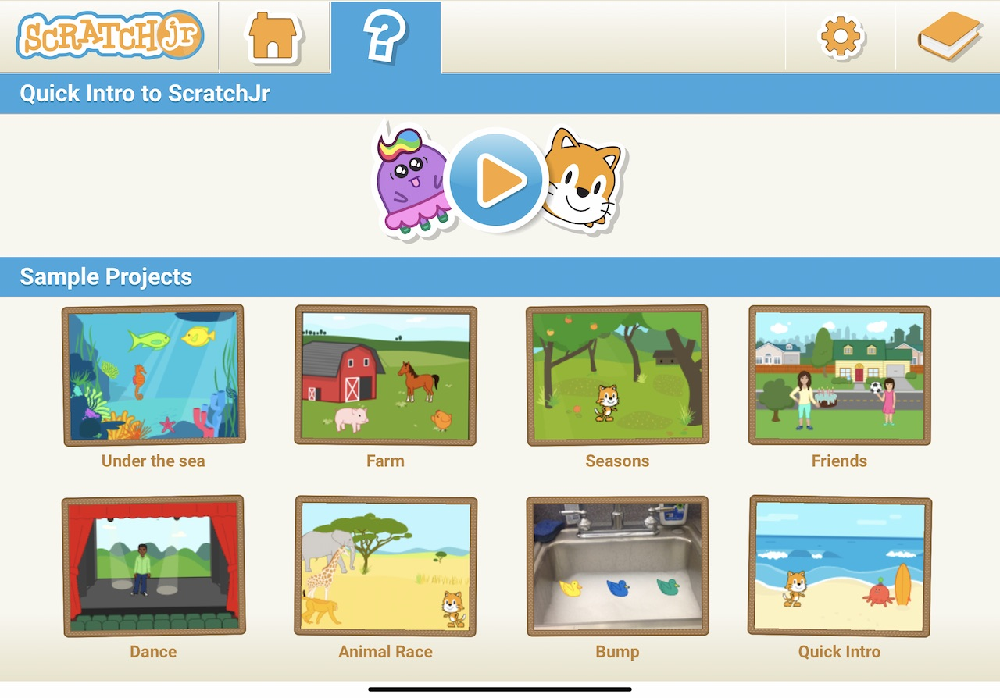

#### 問題4： ScratchJr不是可以拿來寫程式嗎？可是我怎麼只看到孩子拿來做動畫？我可以如何引導孩子學習程式呢？

其實孩子在拖拉積木並將它們組合起來時，就是在撰寫程式囉。每個積木的背後代表著一段程式。

但因為ScratchJr可彈性的撰寫程式，若無適當引導，孩子有可能迷失在其中，建議可以引導孩子先隨意探索每個積木的功能。

以我帶著6歲兒子的經驗，是從帶著他先將工具箱區域可選擇的積木，試著一個一個拉至程式撰寫區中，用手或滑鼠對著積木按一下，『哇，看見舞台區的（角色）會動了』

下一次再試試看：跳起來，說話...分別對著積木點一下，角色就會做積木上的動作。

無需文字說明，孩子用看的，就可以理解了解積木的功能。

接著再請孩子嘗試將積木組合起來，就像組樂高積木一樣，將積木黏在一起。

再點選一次已經黏起來的積木，就可以看到螢幕上的角色，會依照積木的先後順序執行一連串的動作。

角色可以用程式積木拉取的方式設定動作或聲音

可以善用平板電腦的麥克風錄製聲音

用相機拍攝照片的方式，為創作的角色做客製化設計

之後，還可以鼓勵孩子用ScratchJr說個小故事，或是做個小遊戲，

網路上或是書籍都可以很容易找到資源，可以帶著孩子學習。在製作的過程中，可搭配學習程式的基礎概念，例如：迴圈（loop）.除錯（debug）.事件（Events)。

[延伸閱讀：ScratchJr可以學習到什麼程式概念？適合我的孩子學習嗎？](https://assemble.io)

#### 問題5:  學會ScratchJr後可以怎麼延伸呢？

可延伸學習Scratch，ScratchJr 算是 Scratch 積木較少的簡化版本，所以孩子在學習過ScratchJr後，要延伸學習Scratch，因介面是一致的，會較容易快速上手。

再加上Scratch擴充性非常的高，學習Scratch可再與其他程式語言結合或是連接外部硬體做出更多有趣的應用。

[延伸閱讀：Scratch與ScratchJr的差異是什麼？各適合什麼樣的年齡學習？](../what_is_the_different_scratch_scratchjr/)